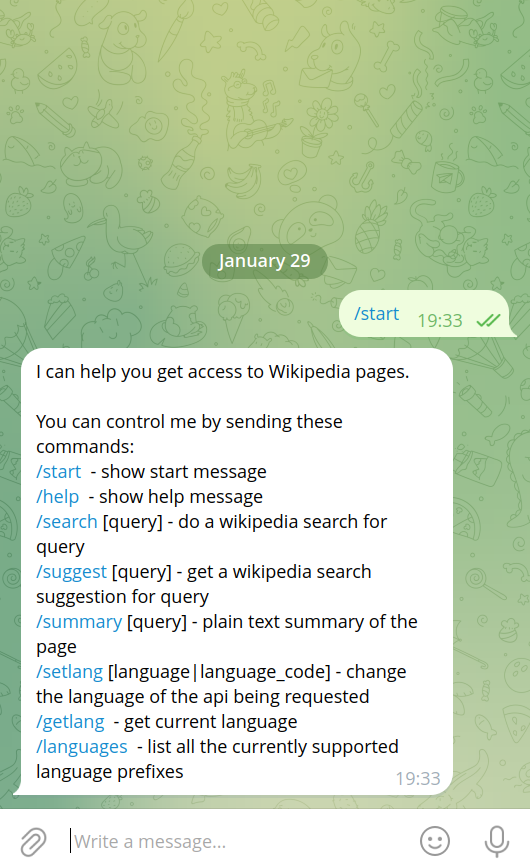

Telegram Wiki Bot.





Create .env file with Telegram Api Token:
```sh
echo "TELEGRAM_API_TOKEN=$YOUR_TOKEN" >.env
```

Install the project dependencies:
```sh
poetry install
```

Run bot:
```sh
make run
```

Run tests with coverage:
```sh
make test
```
